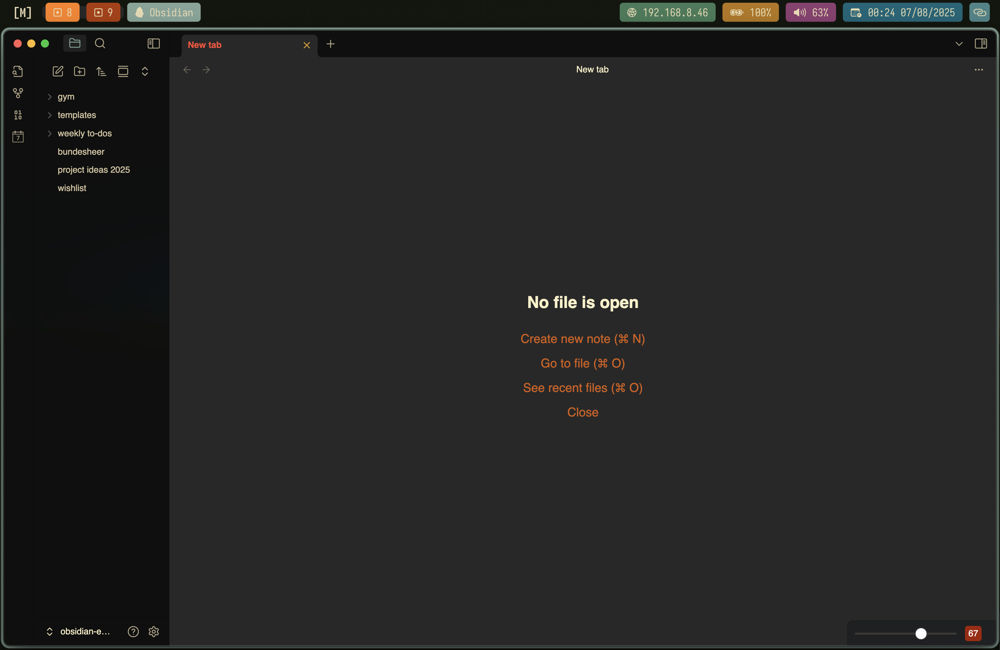

# macOS dotfiles

A curated collection of dotfiles and configurations for a streamlined, modern macOS development environment.




## Features

- **Shell Environment**
  - `.zshrc` with Oh My Zsh, plugins, themes, and custom aliases
  - Eza for improved file listing
- **Window Management**
  - Aerospace configuration for tiling
  - Borders for window border enhancement
- **System Monitoring**
  - SketchyBar for a customizable status bar (CPU, memory, network, battery, workspaces, Spotify, and more)
  - Btop for terminal-based system monitoring
- **Terminal**
  - Ghostty configuration for a fast terminal
- **Neovim**
  - Personal Neovim configuration for a modern, efficient editing experience
- **Color Consistency**
  - Gruvbox-inspired color scheme across apps

## Requirements

- [Homebrew](https://brew.sh/) (for installing dependencies)
- [Git](https://git-scm.com/)  
  `brew install git`
- [GNU Stow](https://www.gnu.org/software/stow/)  
  `brew install stow`
- (Optional) [Oh My Zsh](https://ohmyz.sh/) for shell configuration

## Installation

1. **Clone the repository into your home directory**
   ```bash
   git clone git@github.com:bedlinger/dotfiles.git ~/dotfiles
   cd ~/dotfiles
   ```

2. **Symlink all configurations using GNU Stow**
   ```bash
   stow .
   ```
   > _Tip: Back up any existing config files before running Stow._

3. **(Optional) Stow only selected configs**
   ```bash
   stow .zshrc
   stow .config/nvim
   stow .config/sketchybar
   ```

## Usage & Updates

- **Update dotfiles:**  
  ```bash
  cd ~/dotfiles
  git pull origin main
  stow .
  ```
- **Edit and customize configs:**  
  - Neovim: `.config/nvim`
  - Aerospace : `.config/aerospace.toml`
  - SketchyBar: `.config/sketchybar`
  - Zsh: `.zshrc`
  - Ghostty: `.config/ghostty/config`
- **Color scheme:**  
  Most configs use Gruvbox colors
  
## Adding or Modifying Configurations

1. Place your new config directory or file inside the repo (e.g., `.config/nvim` for Neovim).
2. Use `stow <target>` to symlink it.
3. If you need to exclude files, add patterns to `.stow-local-ignore`.
4. Test after each change.

## Contribution

Contributions are welcome!  
Fork the repo, create a feature branch, commit your changes, and open a Pull Request.
